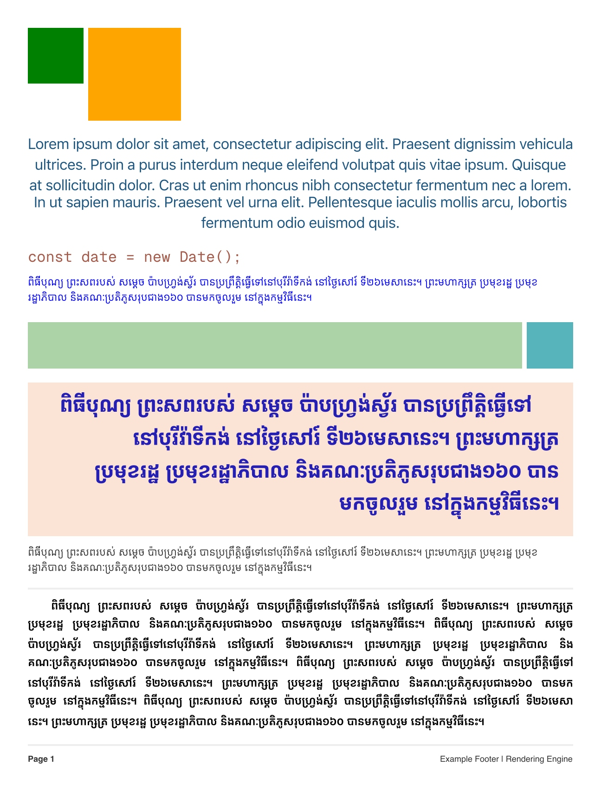
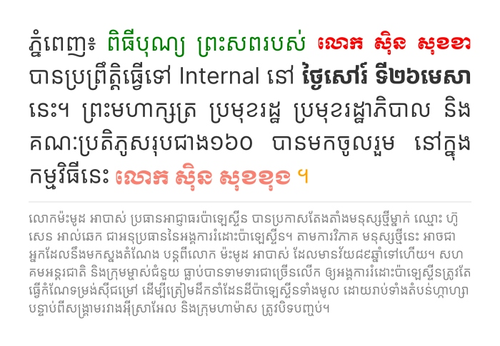
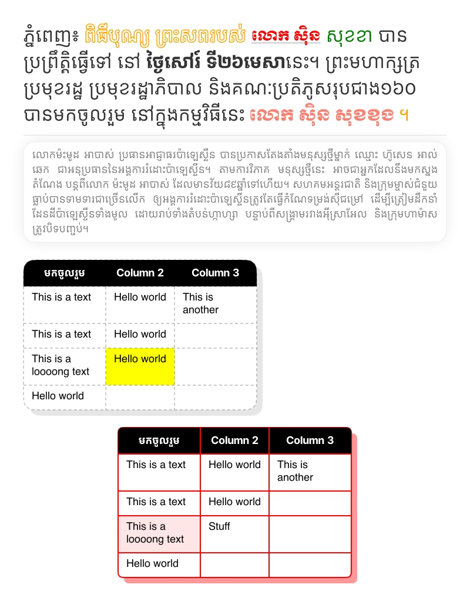
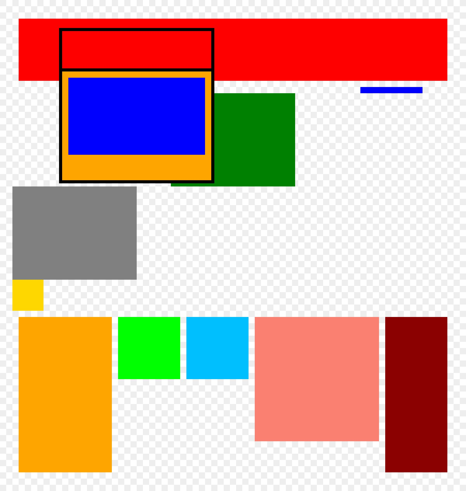
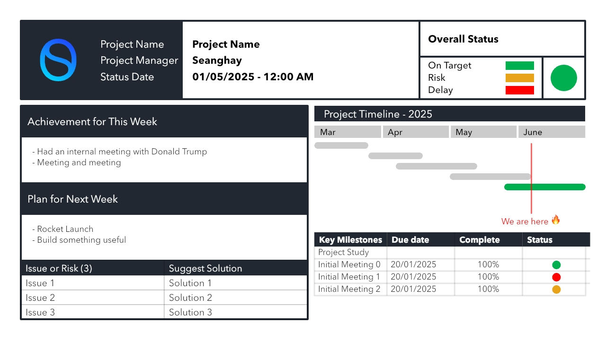

# Sone


> **សូន** - *ប្រមូលអ្វីៗដែលមានសាច់ទន់ជ្រាយឱ្យកើតជាដុំ, ជាគ្រាប់ឬជារូប*

SwiftUI-inspired canvas layout engine with advanced rich text support. Sone is built to generate PDF or Image on the server with minimal memory footprint and performance. It provides some features such as

- Flex Layout ([yoga-layout](https://www.yogalayout.dev/))
- SVG Support without rasterizing through ([Canvg](https://github.com/canvg/canvg))
- Squircle Rounded Corner (iOS-like)
- Text Alignment (Left, Right, Center, **Justify**) for Khmer, Thai, Lao and some langauges.
- Font Tracing - Get a list of fonts that used in the component tree. (See [test/text-01.js](test/text-01.js))
- Table (See [test/table.js](test/table.js))
- Repeating Linear Gradient & Linear Gradient
- Composable
- Output as SVG, PDF, and Image

### Get started 

```shell
npm install sonejs
```

```js
import fs from "node:fs/promises";
import { 
  renderAsCanvas, 
  Column, 
  Text, 
  Span
} from "sonejs";

function Document() {
  return Column(
    Text(
      "Hello world! ",
      Span("Sone.")
        .color("orange")
        .weight("bold")
        .shadow("2px 2px 0px rgba(0,0,0,.2)"),
        " 😍🇰🇭"
    ).size(34),
  ).padding(40);
}

// save as Image
const canvas = renderAsCanvas(Document(), undefined, undefined);
await fs.writeFile("test/output.png", canvas.toBuffer("image/png"));

// save as PDF
const canvas2 = renderAsCanvas(Document(), undefined, undefined, "pdf");
await fs.writeFile("test/output.pdf", canvas2.toBuffer("application/pdf"));
```

Preview


[test/output.pdf](test/output.pdf)

A complex Sone component looks like this

```js
function Document() {
  return Column(
    Text(
      "ភ្នំពេញ៖ ",
      Span("ពិធីបុណ្យ ព្រះសពរបស់ ").color("green"),
      Span("លោក សុិន សុខខា").font("Moul").color("red").size(23),
      Span(" បានប្រព្រឹត្តិធ្វើទៅ Internal នៅ"),
      Span(" ថ្ងៃសៅរ៍ ទី២៦មេសា").weight(700),
      Span(
        "នេះ។ ព្រះមហាក្សត្រ ប្រមុខរដ្ឋ ប្រមុខរដ្ឋាភិបាល និងគណៈប្រតិភូសរុបជាង១៦០ បានមកចូលរួម នៅក្នុងកម្មវិធីនេះ",
      ),
      Span(" លោក សុិន សុខខុង ").font("Moul").color("salmon").size(27),
      Span("។").color("orange"),
    )
      .font("Inter Khmer")
      .size(32)
      .align("justify")
      .color("#333")
      .lineHeight(1.45),
    Flex().height(2, "auto").bg("#eee"),
    Text(
      "....",
    )
      .size(18)
      .font("Inter Khmer")
      .lineHeight(1.4)
      .color("gray"),
  )
    .maxWidth(700)
    .padding(40)
    .gap(10);
}
```


### See Examples

[test/text-01.js](test/text-01.js)



[test/text-02.js](test/text-02.js)



[test/table.js](test/table.js)



[test/basic-01.js](test/basic-01.js)



[test/table-2.js](test/table-2.js)




#### Roadmap

- [x] Flex Engine (Yoga Layout)
- [x] Linear Gradient / Repeating Linear Gradient
- [x] Figma Squircle
- [x] Text Stroke (https://jsfiddle.net/vtmnyea8/)
- [x] Box Shadow
- [x] Text Shadow
- [x] Border
- [x] Text Span
- [x] Align/Justify Enum -> Literal String
- [x] SVG to Path2D
- [x] Image Scale Type
- [ ] Transforms (Scale, Rotate, Translate)
- [ ] Mesh Gradient
- [x] Span OffsetY
- [x] Text Decoration (Underline, Cross, Overline)
- [ ] Mask
- [x] Opacity
- [ ] JSON Serialization
- [ ] JSON Deserialization
- [x] Table
- [ ] Grid
- [x] Background Image
- [x] Emoji
- [x] Font
- [x] Text Fill Gradient
- [x] Non-rasterized SVG (Canvg)
- [x] Font Tracing


### News
- Sone got featured on Khmerload [https://www.khmerload.com/article/208169]

### Reference

- https://github.com/chearon/dropflow
- https://github.com/vercel/satori
- https://github.com/GuptaSiddhant/recanvas
- https://github.com/catalinmiron/react-native-css-gradient
- https://jsfiddle.net/vtmnyea8/
- https://github.com/Automattic/node-canvas
